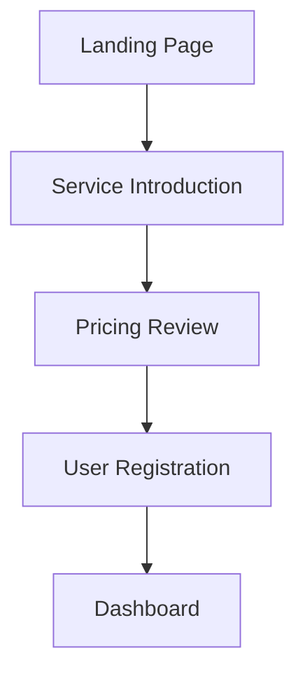

# Web Analyzer - Website Analysis and Specification Extraction Command

## Overview

A command that integrates Playwright MCP with Serena tools to analyze website structure, UI, and UX, automatically generating reference materials for app development.

## Usage

### Basic Syntax
```bash
/web-analyzer <url> [options]
```

### Target Specification

| Target Type | Example | Description |
|-------------|---------|-------------|
| **Full URL** | `https://github.com` | External website analysis |
| **Domain** | `airbnb.com` | Site-wide overview analysis |
| **Specific Page** | `https://stripe.com/pricing` | Detailed page analysis |
| **Competitor Site** | `competitor-site.com` | Competitive analysis |

### Options

| Option | Description | Default |
|--------|-------------|---------|
| `-d, --deep` | Deep analysis (multiple pages) | false |
| `-u, --ui-focus` | UI-focused analysis | false |
| `-x, --ux-flow` | UX flow analysis | false |
| `-t, --tech-stack` | Tech stack detection | false |
| `-c, --components` | Component specification extraction | false |
| `-m, --mobile` | Mobile version analysis | false |
| `-r, --report` | Generate detailed report | false |
| `-s, --screenshots` | Screenshots of each section | false |
| `--lang` | Output language (ja/en) | ja |

### Usage Examples

```bash
# Basic site analysis
/web-analyzer https://example.com

# UI-focused detailed analysis
/web-analyzer https://design-system.com -u -c -s

# UX flow and mobile analysis
/web-analyzer https://ecommerce-site.com -x -m -r

# Tech stack analysis
/web-analyzer https://startup.com -t -d

# Complete competitor analysis
/web-analyzer https://competitor.com -d -u -x -t -c -m -r -s
```

## Feature Details

### 1. Page Structure Analysis

#### HTML Structure Extraction
- Usage of semantic HTML elements
- Header, footer, navigation structure
- Main content area identification
- Section and article structure analysis

#### Layout Pattern Detection
- Grid system identification
- Flexbox usage
- Responsive breakpoints
- Container and wrapper structure

### 2. UI Element Analysis (-u option)

#### Design System Elements
```markdown
## Button Components
### Primary Button
- Background color: #007bff
- Text color: #ffffff
- Padding: 12px 24px
- Border radius: 4px
- Hover effect: +10% brightness

### Secondary Button
- Background color: transparent
- Border: 1px solid #007bff
- Text color: #007bff
```

#### Typography Analysis
- Font family identification
- Heading size hierarchy (H1-H6)
- Body text size and line height
- Color palette extraction

#### Form Elements
- Input field styling
- Validation display methods
- Error and success state design
- Label and placeholder patterns

### 3. UX Flow Analysis (-x option)

#### User Journey Identification


#### Interactive Elements
- CTA button placement and messaging
- Navigation patterns
- Modal and drawer usage
- Page transition patterns

#### Conversion Design
- Micro-interactions
- Progress indicators
- Feedback and confirmation displays
- Error handling and recovery

### 4. Tech Stack Detection (-t option)

#### Frontend Technologies
```javascript
// Detected tech stack
{
  "framework": "React 18.2.0",
  "stateManagement": "Redux Toolkit",
  "styling": "Styled Components",
  "buildTool": "Webpack 5",
  "hosting": "Vercel",
  "analytics": ["Google Analytics 4", "Hotjar"]
}
```

#### Libraries and Frameworks Used
- JavaScript frameworks (React, Vue, Angular, etc.)
- CSS frameworks (Bootstrap, Tailwind, etc.)
- UI component libraries
- Animation libraries

#### Performance Technologies
- Code splitting implementation
- Image optimization techniques
- Cache strategies
- CDN usage

### 5. Component Specification Extraction (-c option)

#### React Component Specification Example
```typescript
// Extracted card component specification
interface CardComponent {
  title: string
  description?: string
  imageUrl?: string
  ctaText: string
  ctaLink: string
  variant: 'primary' | 'secondary' | 'outlined'
}

const CardStyles = {
  container: {
    borderRadius: '8px',
    boxShadow: '0 2px 8px rgba(0,0,0,0.1)',
    padding: '24px',
    backgroundColor: '#ffffff'
  },
  title: {
    fontSize: '1.5rem',
    fontWeight: '600',
    marginBottom: '12px'
  }
}
```

#### Design Tokens
```json
{
  "colors": {
    "primary": "#007bff",
    "secondary": "#6c757d",
    "success": "#28a745",
    "danger": "#dc3545"
  },
  "spacing": {
    "xs": "4px",
    "sm": "8px",
    "md": "16px",
    "lg": "24px",
    "xl": "32px"
  },
  "typography": {
    "fontFamily": "Inter, sans-serif",
    "sizes": {
      "h1": "2.5rem",
      "h2": "2rem",
      "body": "1rem"
    }
  }
}
```

### 6. Mobile Analysis (-m option)

#### Responsive Design Evaluation
- Breakpoint settings
- Mobile-first approach
- Touch operation optimization
- Readability and usability

#### Mobile-Specific Features
- Hamburger menu implementation
- Swipe and pinch gesture support
- Mobile keyboard adaptation
- App-like UI elements

## Serena Integration Features

### Codebase Learning
```typescript
// Analyze current project structure
const projectStructure = await mcp__serena__get_symbols_overview()

// Compare with competitor analysis
const competitorAnalysis = await analyzeCompetitor(url)
const recommendations = compareWithCurrent(projectStructure, competitorAnalysis)
```

### Pattern Memory and Utilization
```typescript
// Save excellent UX patterns to memory
await mcp__serena__write_memory('ux-patterns', {
  site: url,
  patterns: extractedPatterns,
  effectiveness: usabilityScore
})

// Reference past analysis results
const similarAnalyses = await mcp__serena__read_memory('similar-sites')
```

## Report Generation Feature (-r option)

### Auto-Generated Report Structure
```markdown
# Website Analysis Report - {site-name}

## 📊 Overview
- Analysis Target: {target-url}
- Analysis Date: {timestamp}
- Main Technology: {tech-stack}
- Overall Score: {overall-score}/100

## 🎨 Design Analysis
### Color Palette
{extracted-colors}

### Typography
{typography-analysis}

### Layout
{layout-analysis}

## 🧩 Component Analysis
{component-specifications}

## 📱 Mobile Support
{mobile-analysis}

## 🔧 Tech Stack
{tech-stack-details}

## 💡 Improvement Suggestions
1. {improvement-suggestion-1}
2. {improvement-suggestion-2}
3. {improvement-suggestion-3}

## 📋 Implementation Recommendations
{implementation-recommendations}
```

### Competitive Comparison Feature
```bash
# Multi-site comparison analysis
/web-analyzer https://competitor1.com -r
/web-analyzer https://competitor2.com -r
# Automatically generate comparison report
```

## Implementation Workflow

### Step 1: Initial Analysis
```typescript
// Page access and basic info gathering
await mcp__playwright__browser_navigate(targetUrl)
const pageSnapshot = await mcp__playwright__browser_snapshot()
const networkRequests = await mcp__playwright__browser_network_requests()
```

### Step 2: DOM Structure Analysis
```typescript
// Detailed page structure analysis
const domStructure = await mcp__playwright__browser_evaluate(`
  return {
    semanticElements: getSemanticElements(),
    interactiveElements: getInteractiveElements(),
    layoutStructure: getLayoutStructure()
  }
`)
```

### Step 3: Style and Technology Analysis
```typescript
// CSS and JavaScript analysis
const technicalAnalysis = await mcp__playwright__browser_evaluate(`
  return {
    frameworks: detectFrameworks(),
    cssFrameworks: detectCSSFrameworks(),
    libraries: detectLibraries(),
    designTokens: extractDesignTokens()
  }
`)
```

### Step 4: UX Flow Analysis (when -x option)
```typescript
// User journey analysis
const uxAnalysis = await analyzeUserJourney({
  entryPoints: findEntryPoints(pageSnapshot),
  ctaElements: findCTAElements(pageSnapshot),
  navigationFlow: analyzeNavigation(pageSnapshot)
})
```

### Step 5: Serena Integration Processing
```typescript
// Comparison with current project
const currentProject = await mcp__serena__get_symbols_overview()
const comparison = compareWithCurrent(analysisResults, currentProject)

// Save as learning data
await mcp__serena__write_memory('competitor-analysis', {
  url: targetUrl,
  analysis: analysisResults,
  recommendations: comparison.recommendations
})
```

### Step 6: Report Generation and Output
```typescript
// Comprehensive report generation
const comprehensiveReport = generateReport({
  basicAnalysis,
  uiAnalysis,
  uxAnalysis,
  technicalAnalysis,
  recommendations: serenaRecommendations
})

// File output
await writeReport(comprehensiveReport, outputFormat)
```

## Screenshot Feature (-s option)

### Automatic Capture Targets
- Full page screenshots
- Major section screenshots
- Interactive element state changes
- Mobile vs desktop comparison

### File Structure
```
screenshots/
├── {site-name}-full-page.png
├── {site-name}-header.png
├── {site-name}-main-content.png
├── {site-name}-footer.png
├── mobile/
│   ├── {site-name}-mobile-full.png
│   └── {site-name}-mobile-nav.png
```

## Error Handling

### Common Errors and Solutions

#### Access Restriction Error
```bash
❌ Error: Cannot access site (403/429)
Solutions:
1. Check robots.txt
2. Adjust User-Agent
3. Adjust request frequency
```

#### JavaScript Execution Error
```bash
❌ Error: Failed to analyze page JavaScript
Solutions:
1. Use --wait option for load waiting
2. Execute staged analysis
3. Simplify tech stack detection
```

#### Large Site Error
```bash
❌ Error: Analysis failed due to memory shortage
Solutions:
1. Remove --deep option
2. Analyze specific sections only
3. Split analysis into multiple runs
```

## Performance Optimization

### Analysis Efficiency Improvement
- Time reduction through parallel processing
- Cache feature utilization
- Avoid unnecessary resource loading

### Memory Management
- Staged processing of large data
- Proper cleanup of temporary files
- Browser process optimization

## Real Usage Examples

### Startup Competitive Analysis
```bash
# Slack alternative service analysis
/web-analyzer https://discord.com -d -u -x -t -c -r
/web-analyzer https://mattermost.com -d -u -x -t -c -r
/web-analyzer https://rocket.chat -d -u -x -t -c -r
```

### E-commerce Site Analysis
```bash
# Amazon-style UI implementation reference
/web-analyzer https://amazon.com/products -u -c -s
# Generate React component specs from analysis
```

### SaaS Dashboard Analysis
```bash
# Admin panel UI reference
/web-analyzer https://analytics.google.com -u -x -c -m
# Learn mobile-first dashboard design
```

## Integration and Collaboration Features

### Integration with Other Commands
```bash
# Analysis → Test → Improvement cycle
/web-analyzer competitor.com -r
/playwright-test localhost:3000 -s  # Post-implementation comparison test
/visual-regression localhost:3000 -b competitor.com  # Visual comparison
```

### Development Workflow Integration
```bash
# Design phase utilization
/web-analyzer reference-site.com -u -c > design-tokens.json
# Implementation phase utilization
/web-analyzer competitor.com -x > user-journey.md
```

## Limitations and Considerations

### Analyzable Sites
- ✅ Static sites and SPAs
- ✅ Responsive design
- ✅ Modern frameworks
- ⚠️ Authentication-required pages (limited)

### Difficult to Analyze Sites
- ❌ Heavy JavaScript-dependent sites
- ❌ Flash/legacy technology-based
- ❌ Complex authentication/session management
- ❌ Region/IP restricted sites

## Output Files and Data

### Generated Files
- `analysis-report-{timestamp}.md` - Main report
- `components-{site}.json` - Component specifications
- `design-tokens-{site}.json` - Design tokens
- `tech-stack-{site}.json` - Technical information
- `screenshots/` - Screenshot collection

### Serena Memory Stored Data
- Competitive analysis result accumulation
- Excellent UX pattern library
- Technology trend tracking
- Improvement suggestion history