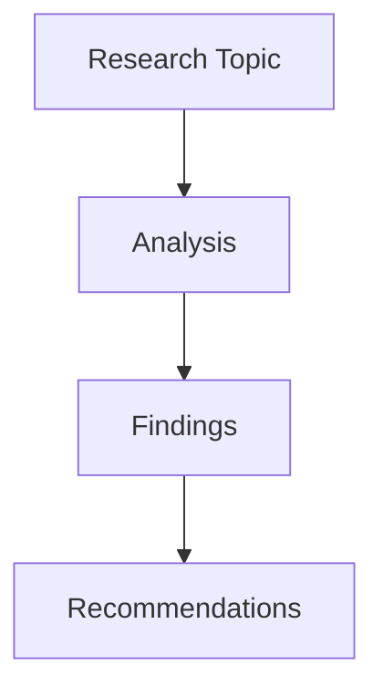

## Context

- Project tech stacks: @package.json
- Project requirements: !`find . -name ".claude/requirements.md"`
- Existing documentation: !`find . -name "*.md" | head -10`
- Project structure: !`ls -la`

## Quick Reference

```bash
/tech-research "<topic>"                              # Standard research
/tech-research "React vs Vue" -m think-harder        # Deep analysis
/tech-research "GraphQL best practices" -m ultrathink -b 50000  # Maximum depth
/tech-research "OAuth 2.0" -t technical --diagrams   # Technical with visuals
```

## Thinking Modes

| Mode | Token Budget | Depth | Use Case |
|------|--------------|-------|----------|
| `think` | 10,000 | Standard analysis | Quick research, overviews |
| `think-hard` | 20,000 | Enhanced validation | Detailed comparisons |
| `think-harder` | 30,000 | Structured reasoning | Complex topics, decisions |
| `ultrathink` | 50,000 | Maximum depth | Critical analysis, academic |

## Core Options

| Option | Description | Default | Example |
|--------|-------------|---------|---------|
| `-m, --mode` | Thinking mode | `think` | `-m ultrathink` |
| `-b, --budget` | Token budget | Auto | `-b 25000` |
| `-o, --output` | Output file | `research-report.md` | `-o analysis.md` |
| `-f, --format` | Output format | `markdown` | `-f json` |
| `--mcp` | MCP tools to use | `all` | `--mcp "context7,sequential"` |

## Research Options

| Option | Description | Values | Example |
|--------|-------------|--------|---------|
| `-d, --depth` | Search depth | `quick\|standard\|deep\|exhaustive` | `-d deep` |
| `-t, --template` | Report template | `overview\|comprehensive\|academic\|technical` | `-t academic` |
| `-i, --iterations` | Max iterations | Number | `-i 10` |
| `-c, --confidence` | Confidence threshold | 0-1 | `-c 0.9` |
| `--sources` | Include citations | Boolean | `--sources` |
| `--diagrams` | Generate diagrams | Boolean | `--diagrams` |
| `-l, --language` | Output language | `en\|ja\|es\|fr\|de\|zh` | `-l ja` |

## MCP Tool Integration

### Available Tools

| Tool | Purpose | Best For |
|------|---------|----------|
| `context7` | Library docs & examples | Framework research, API docs |
| `sequential` | Step-by-step reasoning | Complex analysis, algorithms |
| `playwright` | Web automation | Live testing, screenshots |
| `serena` | Structured problem-solving | Implementation planning |

### Tool Combinations

```bash
# Documentation research
/tech-research "Next.js 14 features" --mcp "context7"

# Complex algorithm analysis
/tech-research "Quantum computing basics" --mcp "sequential" -m think-harder

# Live web research with screenshots
/tech-research "Top UI frameworks 2024" --mcp "playwright,context7" --diagrams

# Full analysis with all tools
/tech-research "Microservices architecture" --mcp all -m ultrathink
```

## Research Templates

### Overview Template
Quick summary with key points
```bash
/tech-research "Docker basics" -t overview -d quick
```

### Comprehensive Template
Full analysis with all aspects
```bash
/tech-research "Kubernetes deployment" -t comprehensive -m think-hard
```

### Academic Template
Research paper format with citations
```bash
/tech-research "Machine learning trends" -t academic --sources --diagrams
```

### Technical Template
Implementation-focused with code
```bash
/tech-research "REST API design" -t technical -c 0.95
```

## Usage Patterns

### Quick Research
```bash
# Fast overview for decisions
/tech-research "Redis vs Memcached" -d quick -t overview

# Technology comparison
/tech-research "Python vs Node.js for backend" -m think
```

### Deep Analysis
```bash
# Comprehensive framework analysis
/tech-research "React architecture patterns" -m think-harder -t comprehensive --diagrams

# Security research with high confidence
/tech-research "Zero-trust security model" -m ultrathink -c 0.95 --sources
```

### Implementation Research
```bash
# Technical implementation guide
/tech-research "Implementing OAuth 2.0 with PKCE" -t technical -m think-hard

# Code-focused with examples
/tech-research "WebSocket implementation" -t technical --mcp "context7" -d deep
```

### Academic Research
```bash
# Literature review with citations
/tech-research "Distributed systems consensus" -t academic -m ultrathink --sources

# Research paper preparation
/tech-research "Blockchain scalability solutions" -t academic -b 50000 --diagrams
```

## Advanced Features

### Multi-Language Output
```bash
# Japanese technical documentation
/tech-research "Docker コンテナ化" -l ja -t technical

# Spanish overview
/tech-research "Cloud computing basics" -l es -t overview
```

### Custom Confidence Levels
```bash
# High confidence for critical decisions
/tech-research "Database selection for fintech" -c 0.95 -m ultrathink

# Exploratory research with lower threshold
/tech-research "Emerging web technologies" -c 0.6 -d quick
```

### Iteration Control
```bash
# Thorough investigation with more iterations
/tech-research "Performance optimization techniques" -i 15 -m think-harder

# Quick single-pass research
/tech-research "Git basics" -i 1 -d quick
```

## Integration with Claude Code

### Workflow Integration

1. **Research Phase**
   ```bash
   /tech-research "Best testing framework for React" -t technical
   ```

2. **Decision Documentation**
   ```bash
   /tech-research "Architecture decision: Monolith vs Microservices" -t comprehensive --sources
   ```

3. **Implementation Planning**
   ```bash
   /tech-research "Migration strategy to TypeScript" -t technical -m think-harder
   ```

### Combining with Other Commands

```bash
# Research then implement
/tech-research "State management solutions" -t technical
/serena "implement Redux toolkit" -s -t

# Research then create requirements
/tech-research "Authentication methods" -m think-hard
/requirements "Auth System" -t "jwt,oauth2" --suggest
```

## Output Examples

### Standard Report Structure
```markdown
# Technical Research Report: [Topic]

## Executive Summary
- Key findings and recommendations

## Table of Contents
1. Introduction
2. Core Concepts
3. Technical Analysis
4. Implementation Considerations
5. Best Practices
6. Comparisons
7. Recommendations
8. Conclusion
9. References

## Detailed Analysis
[Content based on template and depth]

## Confidence Scores
- Finding 1: 95% confidence
- Finding 2: 88% confidence
```

### With Diagrams


## Best Practices

### Choosing Thinking Modes

1. **Quick Overview**: Use `think` mode
   ```bash
   /tech-research "REST basics" -m think -d quick
   ```

2. **Important Decisions**: Use `think-harder` or `ultrathink`
   ```bash
   /tech-research "Database for high-traffic app" -m ultrathink
   ```

3. **Complex Topics**: Always use higher modes
   ```bash
   /tech-research "Distributed systems design" -m think-harder -b 40000
   ```

### Optimizing Token Usage

1. **Start with lower budgets** for exploration
2. **Increase budget** for critical research
3. **Use caching** for repeated research
4. **Specify MCP tools** instead of "all" when possible

### Quality Assurance

1. **Set appropriate confidence thresholds**
   - 0.9+ for production decisions
   - 0.8+ for important features
   - 0.6+ for exploration

2. **Enable sources** for verification
   ```bash
   /tech-research "Security best practices" --sources -c 0.95
   ```

3. **Use multiple iterations** for complex topics
   ```bash
   /tech-research "System architecture" -i 10 -m think-harder
   ```

## Troubleshooting

### Common Issues

| Issue | Solution |
|-------|----------|
| "Budget exceeded" | Reduce budget or use lower thinking mode |
| "Low confidence results" | Increase iterations or use deeper mode |
| "Missing details" | Switch to comprehensive or technical template |
| "No code examples" | Use technical template with context7 MCP |

### Performance Tips

1. **Use caching** for repeated research
2. **Specify exact MCP tools** needed
3. **Start with standard depth**, increase if needed
4. **Use appropriate templates** for your needs

## Command Examples

### For Different Scenarios

```bash
# Quick decision making
/tech-research "Tailwind vs Bootstrap" -d quick -t overview

# Architecture planning
/tech-research "Microservices patterns" -m think-harder -t comprehensive --diagrams

# Technology evaluation
/tech-research "GraphQL adoption" -m think-hard -c 0.9 --sources

# Learning new technology
/tech-research "Rust for web development" -t technical --mcp "context7"

# Security analysis
/tech-research "OWASP Top 10 2024" -m ultrathink -t comprehensive -c 0.95

# Performance research
/tech-research "Database indexing strategies" -t technical -m think-hard

# Framework comparison
/tech-research "Vue 3 vs React 18" -m think-harder --diagrams -t comprehensive

# Best practices research
/tech-research "CI/CD best practices" -t technical --sources
```

## Integration with Todo System

The command automatically creates todos for follow-up actions:

```bash
# Research with automatic todo generation
/tech-research "API Gateway implementation" -t technical

# Creates todos like:
# - [ ] Validate API Gateway findings
# - [ ] Create proof of concept
# - [ ] Test performance implications
# - [ ] Document architecture decision
```

## Caching System

- Results cached for 24 hours by default
- Cache key: `topic-mode-depth`
- Location: `~/.claude-research-cache/`
- Disable: Use `--no-cache` flag

## Future Enhancements

Planned features:
- **Real-time web scraping** for latest information
- **Comparison matrices** for multiple technologies
- **Export to Confluence/Notion**
- **Team collaboration** features
- **Custom research templates**
- **API integration** for data sources
- **Automated testing** of findings