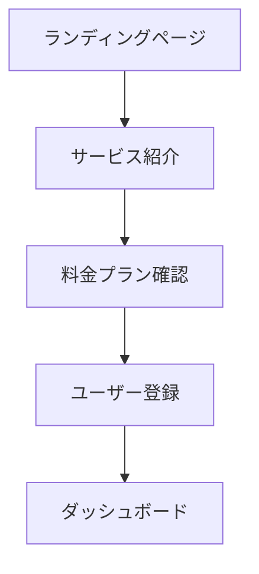

# Web Analyzer - ウェブサイト分析・仕様抽出コマンド

## 概要

Playwright MCPとSerenaツールを統合し、ウェブサイトの構造、UI、UXを分析して、アプリ開発のための参考資料を自動生成するコマンドです。

## 使用方法

### 基本構文
```bash
/web-analyzer <url> [options]
```

### ターゲット指定

| ターゲットタイプ | 例 | 説明 |
|-------------|---------|-------------|
| **完全URL** | `https://github.com` | 外部ウェブサイト分析 |
| **ドメイン** | `airbnb.com` | サイト全体の概要分析 |
| **特定ページ** | `https://stripe.com/pricing` | 詳細ページ分析 |
| **競合サイト** | `competitor-site.com` | 競合分析 |

### オプション

| オプション | 説明 | デフォルト |
|--------|-------------|---------|
| `-d, --deep` | ディープ分析（複数ページ） | false |
| `-u, --ui-focus` | UI重視の分析 | false |
| `-x, --ux-flow` | UXフロー分析 | false |
| `-t, --tech-stack` | 技術スタック検出 | false |
| `-c, --components` | コンポーネント仕様抽出 | false |
| `-m, --mobile` | モバイル版分析 | false |
| `-r, --report` | 詳細レポート生成 | false |
| `-s, --screenshots` | 各セクションのスクリーンショット | false |
| `--lang` | 出力言語 (ja/en) | ja |

### 使用例

```bash
# 基本的なサイト分析
/web-analyzer https://example.com

# UI重視の詳細分析
/web-analyzer https://design-system.com -u -c -s

# UXフローとモバイル分析
/web-analyzer https://ecommerce-site.com -x -m -r

# 技術スタック分析
/web-analyzer https://startup.com -t -d

# 完全な競合分析
/web-analyzer https://competitor.com -d -u -x -t -c -m -r -s
```

## 機能詳細

### 1. ページ構造分析

#### HTML構造抽出
- セマンティックHTML要素の使用状況
- ヘッダー、フッター、ナビゲーション構造
- メインコンテンツエリアの特定
- セクションと記事の構造分析

#### レイアウトパターン検出
- グリッドシステムの特定
- Flexboxの使用状況
- レスポンシブブレークポイント
- コンテナとラッパー構造

### 2. UI要素分析 (-u オプション)

#### デザインシステム要素
```markdown
## ボタンコンポーネント
### プライマリボタン
- 背景色: #007bff
- テキスト色: #ffffff
- パディング: 12px 24px
- 角丸: 4px
- ホバー効果: +10%明度

### セカンダリボタン
- 背景色: transparent
- ボーダー: 1px solid #007bff
- テキスト色: #007bff
```

#### タイポグラフィ分析
- フォントファミリーの特定
- 見出しサイズ階層 (H1-H6)
- 本文テキストサイズと行高
- カラーパレット抽出

#### フォーム要素
- 入力フィールドのスタイリング
- バリデーション表示方法
- エラー・成功状態のデザイン
- ラベルとプレースホルダーパターン

### 3. UXフロー分析 (-x オプション)

#### ユーザージャーニー特定


#### インタラクティブ要素
- CTAボタンの配置とメッセージング
- ナビゲーションパターン
- モーダルとドロワーの使用
- ページ遷移パターン

#### コンバージョンデザイン
- マイクロインタラクション
- プログレスインジケーター
- フィードバックと確認表示
- エラーハンドリングとリカバリー

### 4. 技術スタック検出 (-t オプション)

#### フロントエンド技術
```javascript
// 検出された技術スタック
{
  "framework": "React 18.2.0",
  "stateManagement": "Redux Toolkit",
  "styling": "Styled Components",
  "buildTool": "Webpack 5",
  "hosting": "Vercel",
  "analytics": ["Google Analytics 4", "Hotjar"]
}
```

#### 使用ライブラリとフレームワーク
- JavaScriptフレームワーク (React, Vue, Angular等)
- CSSフレームワーク (Bootstrap, Tailwind等)
- UIコンポーネントライブラリ
- アニメーションライブラリ

#### パフォーマンス技術
- コードスプリッティング実装
- 画像最適化テクニック
- キャッシュ戦略
- CDN使用状況

### 5. コンポーネント仕様抽出 (-c オプション)

#### Reactコンポーネント仕様例
```typescript
// 抽出されたカードコンポーネント仕様
interface CardComponent {
  title: string
  description?: string
  imageUrl?: string
  ctaText: string
  ctaLink: string
  variant: 'primary' | 'secondary' | 'outlined'
}

const CardStyles = {
  container: {
    borderRadius: '8px',
    boxShadow: '0 2px 8px rgba(0,0,0,0.1)',
    padding: '24px',
    backgroundColor: '#ffffff'
  },
  title: {
    fontSize: '1.5rem',
    fontWeight: '600',
    marginBottom: '12px'
  }
}
```

#### デザイントークン
```json
{
  "colors": {
    "primary": "#007bff",
    "secondary": "#6c757d",
    "success": "#28a745",
    "danger": "#dc3545"
  },
  "spacing": {
    "xs": "4px",
    "sm": "8px",
    "md": "16px",
    "lg": "24px",
    "xl": "32px"
  },
  "typography": {
    "fontFamily": "Inter, sans-serif",
    "sizes": {
      "h1": "2.5rem",
      "h2": "2rem",
      "body": "1rem"
    }
  }
}
```

### 6. モバイル分析 (-m オプション)

#### レスポンシブデザイン評価
- ブレークポイント設定
- モバイルファーストアプローチ
- タッチ操作の最適化
- 可読性とユーザビリティ

#### モバイル固有機能
- ハンバーガーメニュー実装
- スワイプ・ピンチジェスチャー対応
- モバイルキーボード対応
- アプリライクなUI要素

## Serena統合機能

### コードベース学習
```typescript
// 現在のプロジェクト構造を分析
const projectStructure = await mcp__serena__get_symbols_overview()

// 競合分析と比較
const competitorAnalysis = await analyzeCompetitor(url)
const recommendations = compareWithCurrent(projectStructure, competitorAnalysis)
```

### パターン記憶と活用
```typescript
// 優れたUXパターンをメモリに保存
await mcp__serena__write_memory('ux-patterns', {
  site: url,
  patterns: extractedPatterns,
  effectiveness: usabilityScore
})

// 過去の分析結果を参照
const similarAnalyses = await mcp__serena__read_memory('similar-sites')
```

## レポート生成機能 (-r オプション)

### 自動生成レポート構造
```markdown
# ウェブサイト分析レポート - {site-name}

## 📊 概要
- 分析対象: {target-url}
- 分析日時: {timestamp}
- 主要技術: {tech-stack}
- 総合スコア: {overall-score}/100

## 🎨 デザイン分析
### カラーパレット
{extracted-colors}

### タイポグラフィ
{typography-analysis}

### レイアウト
{layout-analysis}

## 🧩 コンポーネント分析
{component-specifications}

## 📱 モバイル対応
{mobile-analysis}

## 🔧 技術スタック
{tech-stack-details}

## 💡 改善提案
1. {improvement-suggestion-1}
2. {improvement-suggestion-2}
3. {improvement-suggestion-3}

## 📋 実装推奨事項
{implementation-recommendations}
```

### 競合比較機能
```bash
# 複数サイトの比較分析
/web-analyzer https://competitor1.com -r
/web-analyzer https://competitor2.com -r
# 自動的に比較レポートを生成
```

## 実装ワークフロー

### ステップ1: 初期分析
```typescript
// ページアクセスと基本情報取得
await mcp__playwright__browser_navigate(targetUrl)
const pageSnapshot = await mcp__playwright__browser_snapshot()
const networkRequests = await mcp__playwright__browser_network_requests()
```

### ステップ2: DOM構造分析
```typescript
// 詳細なページ構造分析
const domStructure = await mcp__playwright__browser_evaluate(`
  return {
    semanticElements: getSemanticElements(),
    interactiveElements: getInteractiveElements(),
    layoutStructure: getLayoutStructure()
  }
`)
```

### ステップ3: スタイルと技術分析
```typescript
// CSSとJavaScript分析
const technicalAnalysis = await mcp__playwright__browser_evaluate(`
  return {
    frameworks: detectFrameworks(),
    cssFrameworks: detectCSSFrameworks(),
    libraries: detectLibraries(),
    designTokens: extractDesignTokens()
  }
`)
```

### ステップ4: UXフロー分析 (-x オプション時)
```typescript
// ユーザージャーニー分析
const uxAnalysis = await analyzeUserJourney({
  entryPoints: findEntryPoints(pageSnapshot),
  ctaElements: findCTAElements(pageSnapshot),
  navigationFlow: analyzeNavigation(pageSnapshot)
})
```

### ステップ5: Serena統合処理
```typescript
// 現在のプロジェクトとの比較
const currentProject = await mcp__serena__get_symbols_overview()
const comparison = compareWithCurrent(analysisResults, currentProject)

// 学習データとして保存
await mcp__serena__write_memory('competitor-analysis', {
  url: targetUrl,
  analysis: analysisResults,
  recommendations: comparison.recommendations
})
```

### ステップ6: レポート生成と出力
```typescript
// 総合レポート生成
const comprehensiveReport = generateReport({
  basicAnalysis,
  uiAnalysis,
  uxAnalysis,
  technicalAnalysis,
  recommendations: serenaRecommendations
})

// ファイル出力
await writeReport(comprehensiveReport, outputFormat)
```

## スクリーンショット機能 (-s オプション)

### 自動キャプチャ対象
- フルページスクリーンショット
- 主要セクションスクリーンショット
- インタラクティブ要素の状態変化
- モバイルvsデスクトップ比較

### ファイル構造
```
screenshots/
├── {site-name}-full-page.png
├── {site-name}-header.png
├── {site-name}-main-content.png
├── {site-name}-footer.png
├── mobile/
│   ├── {site-name}-mobile-full.png
│   └── {site-name}-mobile-nav.png
```

## エラーハンドリング

### よくあるエラーと解決策

#### アクセス制限エラー
```bash
❌ Error: Cannot access site (403/429)
解決策:
1. robots.txtを確認
2. User-Agentを調整
3. リクエスト頻度を調整
```

#### JavaScript実行エラー
```bash
❌ Error: Failed to analyze page JavaScript
解決策:
1. --wait オプションで読み込み待機
2. 段階的分析を実行
3. 技術スタック検出を簡略化
```

#### 大規模サイトエラー
```bash
❌ Error: Analysis failed due to memory shortage
解決策:
1. --deep オプションを外す
2. 特定セクションのみ分析
3. 分析を複数回に分割
```

## パフォーマンス最適化

### 分析効率向上
- 並列処理による時間短縮
- キャッシュ機能の活用
- 不要なリソース読み込み回避

### メモリ管理
- 大規模データの段階的処理
- 一時ファイルの適切なクリーンアップ
- ブラウザプロセスの最適化

## 実際の使用例

### スタートアップ競合分析
```bash
# Slack代替サービスの分析
/web-analyzer https://discord.com -d -u -x -t -c -r
/web-analyzer https://mattermost.com -d -u -x -t -c -r
/web-analyzer https://rocket.chat -d -u -x -t -c -r
```

### Eコマースサイト分析
```bash
# Amazon風UIの実装参考
/web-analyzer https://amazon.com/products -u -c -s
# 分析結果からReactコンポーネント仕様を生成
```

### SaaSダッシュボード分析
```bash
# 管理画面UI参考
/web-analyzer https://analytics.google.com -u -x -c -m
# モバイルファーストダッシュボードデザインを学習
```

## 統合・連携機能

### 他のコマンドとの連携
```bash
# 分析 → テスト → 改善サイクル
/web-analyzer competitor.com -r
/playwright-test localhost:3000 -s  # 実装後の比較テスト
/visual-regression localhost:3000 -b competitor.com  # ビジュアル比較
```

### 開発ワークフロー統合
```bash
# デザインフェーズでの活用
/web-analyzer reference-site.com -u -c > design-tokens.json
# 実装フェーズでの活用
/web-analyzer competitor.com -x > user-journey.md
```

## 制限事項と考慮点

### 分析可能なサイト
- ✅ 静的サイトとSPA
- ✅ レスポンシブデザイン
- ✅ モダンフレームワーク
- ⚠️ 認証が必要なページ（制限あり）

### 分析が困難なサイト
- ❌ 重度のJavaScript依存サイト
- ❌ Flash/レガシー技術ベース
- ❌ 複雑な認証/セッション管理
- ❌ 地域/IP制限付きサイト

## 出力ファイルとデータ

### 生成ファイル
- `analysis-report-{timestamp}.md` - メインレポート
- `components-{site}.json` - コンポーネント仕様
- `design-tokens-{site}.json` - デザイントークン
- `tech-stack-{site}.json` - 技術情報
- `screenshots/` - スクリーンショットコレクション

### Serenaメモリ保存データ
- 競合分析結果の蓄積
- 優れたUXパターンライブラリ
- 技術トレンドトラッキング
- 改善提案履歴
