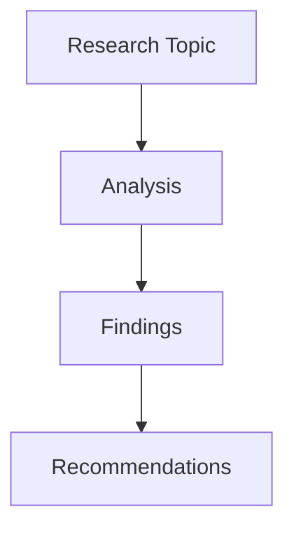

## Context

- Project tech stacks: @package.json
- Project requirements: !`find . -name ".claude/requirements.md"`
- Existing documentation: !`find . -name "*.md" | head -10`
- Project structure: !`ls -la`

## Quick Reference

```bash
/tech-research "<topic>"                              # Standard research
/tech-research "React vs Vue" -m think-harder        # Deep analysis
/tech-research "GraphQL best practices" -m ultrathink -b 50000  # Maximum depth
/tech-research "OAuth 2.0" -t technical --diagrams   # Technical with visuals
```

## Thinking Modes

| Mode | Token Budget | Depth | Use Case |
|------|--------------|-------|----------|
| `think` | 10,000 | Standard analysis | Quick research, overviews |
| `think-hard` | 20,000 | Enhanced validation | Detailed comparisons |
| `think-harder` | 30,000 | Structured reasoning | Complex topics, decisions |
| `ultrathink` | 50,000 | Maximum depth | Critical analysis, academic |

## Core Options

| Option | Description | Default | Example |
|--------|-------------|---------|---------|
| `-m, --mode` | Thinking mode | `think` | `-m ultrathink` |
| `-b, --budget` | Token budget | Auto | `-b 25000` |
| `-o, --output` | Output file | `research-report.md` | `-o analysis.md` |
| `-f, --format` | Output format | `markdown` | `-f json` |
| `--mcp` | MCP tools to use | `all` | `--mcp "context7,sequential"` |

## Research Options

| Option | Description | Values | Example |
|--------|-------------|--------|---------|
| `-d, --depth` | Search depth | `quick\|standard\|deep\|exhaustive` | `-d deep` |
| `-t, --template` | Report template | `overview\|comprehensive\|academic\|technical` | `-t academic` |
| `-i, --iterations` | Max iterations | Number | `-i 10` |
| `-c, --confidence` | Confidence threshold | 0-1 | `-c 0.9` |
| `--sources` | Include citations | Boolean | `--sources` |
| `--diagrams` | Generate diagrams | Boolean | `--diagrams` |
| `-l, --language` | Output language | `en\|ja\|es\|fr\|de\|zh` | `-l ja` |

## MCP Tool Integration

## Tool Usage Priorities

**ALWAYS prioritize mcp__serena__ tools for codebase analysis, with other MCPs for specialized needs:**

### Codebase Intelligence (Serena MCP First)
- **Pattern Analysis**: Use `mcp__serena__search_for_pattern` to find existing implementation patterns
- **Symbol Context**: Use `mcp__serena__find_symbol` to understand current architecture
- **Code Overview**: Use `mcp__serena__get_symbols_overview` for architecture-aware recommendations
- **Memory Integration**: Use `mcp__serena__read_memory` / `mcp__serena__write_memory` for research continuity

### Research Enhancement (Other MCPs)
- **Documentation**: Use `mcp__context7__resolve-library-id` and `mcp__context7__get-library-docs` for library research
- **Deep Thinking**: Use `mcp__sequential-thinking__sequentialthinking` for complex analysis
- **Web Research**: Use `mcp__playwright__browser_navigate` for live web research

### Standard Tools (Fallback)
- **File Operations**: Use Read, Write, Edit for documentation creation
- **Search Operations**: Use Grep, Glob when MCP tools unavailable
- **Process Management**: Use TodoWrite for breaking down research tasks

### Available Tools

| Tool | Purpose | Best For | Priority |
|------|---------|----------|----------|
| `serena` | **Codebase-aware analysis** | **Implementation planning, pattern analysis** | **Primary** |
| `context7` | Library docs & examples | Framework research, API docs | Secondary |
| `sequential` | Step-by-step reasoning | Complex analysis, algorithms | Secondary |
| `playwright` | Web automation | Live testing, screenshots | Optional |

### Serena-Specific Features

| Feature | Tool | Purpose | When to Use |
|---------|------|---------|-------------|
| **Codebase Pattern Analysis** | `mcp__serena__search_for_pattern` | Find existing implementation patterns | Always for technical research |
| **Symbol Context** | `mcp__serena__find_symbol` | Understand current architecture | For implementation-focused research |
| **Memory Integration** | `mcp__serena__read_memory` / `mcp__serena__write_memory` | Learn from previous research | For building research knowledge |
| **Implementation Planning** | `mcp__serena__get_symbols_overview` | Architecture-aware recommendations | For technical feasibility analysis |

### Tool Combinations

```bash
# Documentation research
/tech-research "Next.js 14 features" --mcp "context7"

# Codebase-aware research with Serena
/tech-research "React patterns in our codebase" --mcp "serena,context7" --codebase-context

# Complex algorithm analysis
/tech-research "Quantum computing basics" --mcp "sequential" -m think-harder

# Live web research with screenshots
/tech-research "Top UI frameworks 2024" --mcp "playwright,context7" --diagrams

# Full analysis with all tools and codebase integration
/tech-research "Microservices architecture" --mcp all -m ultrathink --serena-memory

# Technical research with implementation context
/tech-research "GraphQL vs REST" --mcp "serena,context7" --implementation-ready
```

## Research Templates

### Overview Template
Quick summary with key points
```bash
/tech-research "Docker basics" -t overview -d quick
```

### Comprehensive Template
Full analysis with all aspects
```bash
/tech-research "Kubernetes deployment" -t comprehensive -m think-hard
```

### Academic Template
Research paper format with citations
```bash
/tech-research "Machine learning trends" -t academic --sources --diagrams
```

### Technical Template
Implementation-focused with code
```bash
/tech-research "REST API design" -t technical -c 0.95
```

## Usage Patterns

### Quick Research
```bash
# Fast overview for decisions
/tech-research "Redis vs Memcached" -d quick -t overview

# Technology comparison
/tech-research "Python vs Node.js for backend" -m think
```

### Deep Analysis
```bash
# Comprehensive framework analysis
/tech-research "React architecture patterns" -m think-harder -t comprehensive --diagrams

# Security research with high confidence
/tech-research "Zero-trust security model" -m ultrathink -c 0.95 --sources
```

### Implementation Research
```bash
# Technical implementation guide
/tech-research "Implementing OAuth 2.0 with PKCE" -t technical -m think-hard

# Code-focused with examples
/tech-research "WebSocket implementation" -t technical --mcp "context7" -d deep
```

### Academic Research
```bash
# Literature review with citations
/tech-research "Distributed systems consensus" -t academic -m ultrathink --sources

# Research paper preparation
/tech-research "Blockchain scalability solutions" -t academic -b 50000 --diagrams
```

## Advanced Features

### Serena-Enhanced Research
```bash
# Research with current codebase context
/tech-research "State management options" --serena-context --current-patterns

# Implementation-ready research
/tech-research "Authentication methods" --mcp "serena,context7" --implementation-plan

# Pattern-aware technology selection
/tech-research "Testing frameworks" --serena-patterns --compatibility-check

# Memory-enhanced research (learns from past decisions)
/tech-research "Database options" --serena-memory --decision-history
```

### Multi-Language Output
```bash
# Japanese technical documentation
/tech-research "Docker コンテナ化" -l ja -t technical

# Spanish overview
/tech-research "Cloud computing basics" -l es -t overview
```

### Custom Confidence Levels
```bash
# High confidence for critical decisions
/tech-research "Database selection for fintech" -c 0.95 -m ultrathink

# Exploratory research with lower threshold
/tech-research "Emerging web technologies" -c 0.6 -d quick
```

### Iteration Control
```bash
# Thorough investigation with more iterations
/tech-research "Performance optimization techniques" -i 15 -m think-harder

# Quick single-pass research
/tech-research "Git basics" -i 1 -d quick
```

## Integration with Claude Code

### Workflow Integration

1. **Research Phase**
   ```bash
   /tech-research "Best testing framework for React" -t technical
   ```

2. **Decision Documentation**
   ```bash
   /tech-research "Architecture decision: Monolith vs Microservices" -t comprehensive --sources
   ```

3. **Implementation Planning**
   ```bash
   /tech-research "Migration strategy to TypeScript" -t technical -m think-harder
   ```

### Combining with Other Commands

```bash
# Research then implement with Serena continuity
/tech-research "State management solutions" -t technical --mcp "serena" --save-context
/serena "implement Redux toolkit" -s -t --use-research-context

# Research with debugging context
/tech-research "Performance optimization" --mcp "serena" --current-issues
/debug-error "slow queries" --serena --use-research

# Research then smart thinking
/tech-research "Architecture options" --mcp "serena,context7" --save-findings
/smart-think "Choose microservices vs monolith" -m think-harder --serena --use-research

# Research then create requirements
/tech-research "Authentication methods" -m think-hard --serena-context
/requirements "Auth System" -t "jwt,oauth2" --suggest
```

## Output Examples

### Standard Report Structure
```markdown
# Technical Research Report: [Topic]

## Executive Summary
- Key findings and recommendations

## Table of Contents
1. Introduction
2. Core Concepts
3. Technical Analysis
4. Implementation Considerations
5. Best Practices
6. Comparisons
7. Recommendations
8. Conclusion
9. References

## Detailed Analysis
[Content based on template and depth]

## Confidence Scores
- Finding 1: 95% confidence
- Finding 2: 88% confidence
```

### With Diagrams


## Best Practices

### Choosing Thinking Modes with Serena

1. **Quick Overview with Context**: Use `think` mode + Serena
   ```bash
   /tech-research "REST basics" -m think -d quick --mcp "serena" --current-context
   ```

2. **Important Decisions**: Use `think-harder` + Serena memory
   ```bash
   /tech-research "Database for high-traffic app" -m ultrathink --serena-memory --patterns
   ```

3. **Complex Topics**: Always use higher modes + full Serena integration
   ```bash
   /tech-research "Distributed systems design" -m think-harder -b 40000 --mcp "serena,context7" --implementation-ready
   ```

### Serena Integration Patterns

1. **Architecture Research**: Always include codebase context
   ```bash
   /tech-research "Choose framework" --mcp "serena,context7" --current-architecture
   ```

2. **Implementation Research**: Use symbol analysis
   ```bash
   /tech-research "Refactoring approach" --mcp "serena" --symbol-analysis --impact-assessment
   ```

3. **Decision Documentation**: Store in Serena memory
   ```bash
   /tech-research "Technology choice" --mcp "serena" --document-decision --store-rationale
   ```

### Optimizing Token Usage

1. **Start with lower budgets** for exploration
2. **Increase budget** for critical research
3. **Use caching** for repeated research
4. **Specify MCP tools** instead of "all" when possible

### Quality Assurance

1. **Set appropriate confidence thresholds**
   - 0.9+ for production decisions
   - 0.8+ for important features
   - 0.6+ for exploration

2. **Enable sources** for verification
   ```bash
   /tech-research "Security best practices" --sources -c 0.95
   ```

3. **Use multiple iterations** for complex topics
   ```bash
   /tech-research "System architecture" -i 10 -m think-harder
   ```

## Troubleshooting

### Common Issues

| Issue | Solution |
|-------|----------|
| "Budget exceeded" | Reduce budget or use lower thinking mode |
| "Low confidence results" | Increase iterations or use deeper mode |
| "Missing details" | Switch to comprehensive or technical template |
| "No code examples" | Use technical template with context7 MCP |

### Performance Tips

1. **Use caching** for repeated research
2. **Specify exact MCP tools** needed
3. **Start with standard depth**, increase if needed
4. **Use appropriate templates** for your needs

## Command Examples

### For Different Scenarios with Serena Integration

```bash
# Quick decision making with current context
/tech-research "Tailwind vs Bootstrap" -d quick -t overview --mcp "serena" --current-styles

# Architecture planning with codebase awareness
/tech-research "Microservices patterns" -m think-harder -t comprehensive --diagrams --mcp "serena" --current-architecture

# Technology evaluation with existing patterns
/tech-research "GraphQL adoption" -m think-hard -c 0.9 --sources --mcp "serena" --migration-analysis

# Learning new technology with implementation context
/tech-research "Rust for web development" -t technical --mcp "context7,serena" --feasibility-check

# Security analysis with current vulnerabilities
/tech-research "OWASP Top 10 2024" -m ultrathink -t comprehensive -c 0.95 --mcp "serena" --security-audit

# Performance research with current bottlenecks
/tech-research "Database indexing strategies" -t technical -m think-hard --mcp "serena" --performance-analysis

# Framework comparison with migration planning
/tech-research "Vue 3 vs React 18" -m think-harder --diagrams -t comprehensive --mcp "serena" --migration-strategy

# Best practices research with current implementation
/tech-research "CI/CD best practices" -t technical --sources --mcp "serena" --current-pipeline-analysis
```

### Serena-Specific Research Patterns

```bash
# Pattern discovery in current codebase
/tech-research "Error handling patterns" --mcp "serena" --pattern-analysis --best-practices

# Technology compatibility analysis
/tech-research "New library integration" --mcp "serena" --compatibility-check --dependency-analysis

# Refactoring research with impact analysis
/tech-research "Code organization patterns" --mcp "serena" --refactoring-safe --impact-minimal

# Performance optimization with current metrics
/tech-research "Performance improvements" --mcp "serena" --current-metrics --optimization-targets

# Architecture evolution planning
/tech-research "System scalability" --mcp "serena" --evolution-path --backward-compatible
```

## Integration with Todo System and Serena Memory

The command automatically creates todos and stores research context:

```bash
# Research with automatic todo generation and Serena integration
/tech-research "API Gateway implementation" -t technical --mcp "serena" --create-todos

# Creates todos like:
# - [ ] Validate API Gateway findings
# - [ ] Create proof of concept using Serena analysis
# - [ ] Test performance implications
# - [ ] Document architecture decision in Serena memory
# - [ ] Update existing codebase patterns
```

### Serena Memory Integration

```bash
# Store research findings for future reference
/tech-research "Framework comparison" --mcp "serena" --store-findings

# Later retrieve and build upon previous research
/tech-research "Framework implementation" --mcp "serena" --use-previous-research

# Cross-reference with existing decisions
/tech-research "New feature architecture" --mcp "serena" --decision-history --consistency-check
```

## Caching System

- Results cached for 24 hours by default
- Cache key: `topic-mode-depth`
- Location: `~/.claude-research-cache/`
- Disable: Use `--no-cache` flag

## Future Enhancements

Planned features:
- **Real-time web scraping** for latest information
- **Comparison matrices** for multiple technologies
- **Export to Confluence/Notion**
- **Team collaboration** features
- **Custom research templates**
- **API integration** for data sources
- **Automated testing** of findings

### Serena-Specific Enhancements
- **Intelligent Research Caching**: Serena-based research result caching and retrieval
- **Pattern-Based Recommendations**: AI-driven suggestions based on codebase patterns
- **Implementation Impact Modeling**: Predict implementation effort and risks
- **Continuous Learning**: Improve research quality based on implementation outcomes
- **Cross-Project Intelligence**: Learn from multiple projects and teams
- **Automated Decision Tracking**: Track technology decisions and their outcomes over time
