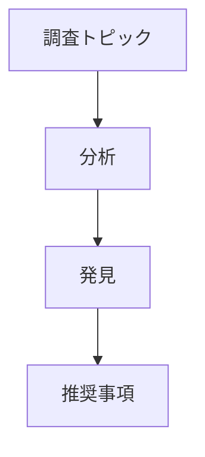

## コンテキスト

- プロジェクト技術スタック: @package.json
- プロジェクト要件: !`find . -name ".claude/requirements.md"`
- 既存ドキュメント: !`find . -name "*.md" | head -10`
- プロジェクト構造: !`ls -la`

## クイックリファレンス

```bash
/tech-research "<トピック>"                              # 標準調査
/tech-research "React vs Vue" -m think-harder        # 深い分析
/tech-research "GraphQL best practices" -m ultrathink -b 50000  # 最大深度
/tech-research "OAuth 2.0" -t technical --diagrams   # 図解付き技術調査
```

## 思考モード

| モード | トークン予算 | 深度 | 使用ケース |
|------|------------|-------|----------|
| `think` | 10,000 | 標準分析 | 簡易調査、概要 |
| `think-hard` | 20,000 | 強化検証 | 詳細比較 |
| `think-harder` | 30,000 | 構造化推論 | 複雑なトピック、意思決定 |
| `ultrathink` | 50,000 | 最大深度 | 重要な分析、学術的 |

## コアオプション

| オプション | 説明 | デフォルト | 例 |
|--------|-------------|---------|---------|
| `-m, --mode` | 思考モード | `think` | `-m ultrathink` |
| `-b, --budget` | トークン予算 | 自動 | `-b 25000` |
| `-o, --output` | 出力ファイル | `research-report.md` | `-o analysis.md` |
| `-f, --format` | 出力形式 | `markdown` | `-f json` |
| `--mcp` | 使用するMCPツール | `all` | `--mcp "context7,sequential"` |

## 調査オプション

| オプション | 説明 | 値 | 例 |
|--------|-------------|--------|---------|
| `-d, --depth` | 検索深度 | `quick\|standard\|deep\|exhaustive` | `-d deep` |
| `-t, --template` | レポートテンプレート | `overview\|comprehensive\|academic\|technical` | `-t academic` |
| `-i, --iterations` | 最大反復回数 | 数値 | `-i 10` |
| `-c, --confidence` | 信頼度閾値 | 0-1 | `-c 0.9` |
| `--sources` | 引用を含む | Boolean | `--sources` |
| `--diagrams` | 図を生成 | Boolean | `--diagrams` |
| `-l, --language` | 出力言語 | `en\|ja\|es\|fr\|de\|zh` | `-l ja` |

## MCP ツール統合

## ツール使用優先度

**常にコードベース分析にはmcp__serena__ツールを優先し、専門的なニーズには他のMCPを使用:**

### コードベースインテリジェンス (Serena MCP優先)
- **パターン分析**: `mcp__serena__search_for_pattern`で既存の実装パターンを発見
- **シンボルコンテキスト**: `mcp__serena__find_symbol`で現在のアーキテクチャを理解
- **コード概要**: `mcp__serena__get_symbols_overview`でアーキテクチャを考慮した推奨
- **メモリ統合**: `mcp__serena__read_memory` / `mcp__serena__write_memory`で調査の継続性を確保

### 調査強化 (他のMCP)
- **ドキュメント**: `mcp__context7__resolve-library-id`と`mcp__context7__get-library-docs`でライブラリ調査
- **深い思考**: `mcp__sequential-thinking__sequentialthinking`で複雑な分析
- **Web調査**: `mcp__playwright__browser_navigate`でライブWeb調査

### 標準ツール (フォールバック)
- **ファイル操作**: Read, Write, Editでドキュメント作成
- **検索操作**: MCPツールが利用不可の場合はGrep, Globを使用
- **プロセス管理**: TodoWriteで調査タスクを分解

### 利用可能なツール

| ツール | 目的 | 最適な用途 | 優先度 |
|------|---------|----------|----------|
| `serena` | **コードベース対応分析** | **実装計画、パターン分析** | **主要** |
| `context7` | ライブラリドキュメントと例 | フレームワーク調査、API文書 | 二次 |
| `sequential` | ステップバイステップ推論 | 複雑な分析、アルゴリズム | 二次 |
| `playwright` | Web自動化 | ライブテスト、スクリーンショット | オプション |

### Serena固有機能

| 機能 | ツール | 目的 | 使用タイミング |
|---------|------|---------|-------------|
| **コードベースパターン分析** | `mcp__serena__search_for_pattern` | 既存の実装パターンを発見 | 常に技術調査時 |
| **シンボルコンテキスト** | `mcp__serena__find_symbol` | 現在のアーキテクチャを理解 | 実装重視の調査 |
| **メモリ統合** | `mcp__serena__read_memory` / `mcp__serena__write_memory` | 過去の調査から学習 | 調査知識の構築 |
| **実装計画** | `mcp__serena__get_symbols_overview` | アーキテクチャを考慮した推奨 | 技術的実現可能性分析 |

### ツール組み合わせ

```bash
# ドキュメント調査
/tech-research "Next.js 14 features" --mcp "context7"

# Serenaによるコードベース対応調査
/tech-research "React patterns in our codebase" --mcp "serena,context7" --codebase-context

# 複雑なアルゴリズム分析
/tech-research "Quantum computing basics" --mcp "sequential" -m think-harder

# スクリーンショット付きライブWeb調査
/tech-research "Top UI frameworks 2024" --mcp "playwright,context7" --diagrams

# 全ツールとコードベース統合での完全分析
/tech-research "Microservices architecture" --mcp all -m ultrathink --serena-memory

# 実装コンテキスト付き技術調査
/tech-research "GraphQL vs REST" --mcp "serena,context7" --implementation-ready
```

## 調査テンプレート

### 概要テンプレート
要点をまとめた簡易サマリー
```bash
/tech-research "Docker basics" -t overview -d quick
```

### 包括的テンプレート
全側面を含む完全分析
```bash
/tech-research "Kubernetes deployment" -t comprehensive -m think-hard
```

### 学術テンプレート
引用付きの論文形式
```bash
/tech-research "Machine learning trends" -t academic --sources --diagrams
```

### 技術テンプレート
コード付きの実装重視
```bash
/tech-research "REST API design" -t technical -c 0.95
```

## 使用パターン

### 簡易調査
```bash
# 意思決定のための高速概要
/tech-research "Redis vs Memcached" -d quick -t overview

# 技術比較
/tech-research "Python vs Node.js for backend" -m think
```

### 深い分析
```bash
# 包括的なフレームワーク分析
/tech-research "React architecture patterns" -m think-harder -t comprehensive --diagrams

# 高信頼度のセキュリティ調査
/tech-research "Zero-trust security model" -m ultrathink -c 0.95 --sources
```

### 実装調査
```bash
# 技術実装ガイド
/tech-research "Implementing OAuth 2.0 with PKCE" -t technical -m think-hard

# 例付きコード重視
/tech-research "WebSocket implementation" -t technical --mcp "context7" -d deep
```

### 学術調査
```bash
# 引用付き文献レビュー
/tech-research "Distributed systems consensus" -t academic -m ultrathink --sources

# 論文準備用調査
/tech-research "Blockchain scalability solutions" -t academic -b 50000 --diagrams
```

## 高度な機能

### Serena強化調査
```bash
# 現在のコードベースコンテキスト付き調査
/tech-research "State management options" --serena-context --current-patterns

# 実装対応調査
/tech-research "Authentication methods" --mcp "serena,context7" --implementation-plan

# パターン認識技術選定
/tech-research "Testing frameworks" --serena-patterns --compatibility-check

# メモリ強化調査（過去の決定から学習）
/tech-research "Database options" --serena-memory --decision-history
```

### 多言語出力
```bash
# 日本語技術ドキュメント
/tech-research "Docker コンテナ化" -l ja -t technical

# スペイン語概要
/tech-research "Cloud computing basics" -l es -t overview
```

### カスタム信頼度レベル
```bash
# 重要な決定には高信頼度
/tech-research "Database selection for fintech" -c 0.95 -m ultrathink

# 低閾値での探索的調査
/tech-research "Emerging web technologies" -c 0.6 -d quick
```

### 反復制御
```bash
# より多くの反復での徹底調査
/tech-research "Performance optimization techniques" -i 15 -m think-harder

# 簡易シングルパス調査
/tech-research "Git basics" -i 1 -d quick
```

## Claude Code との統合

### ワークフロー統合

1. **調査フェーズ**
   ```bash
   /tech-research "Best testing framework for React" -t technical
   ```

2. **決定ドキュメント**
   ```bash
   /tech-research "Architecture decision: Monolith vs Microservices" -t comprehensive --sources
   ```

3. **実装計画**
   ```bash
   /tech-research "Migration strategy to TypeScript" -t technical -m think-harder
   ```

### 他のコマンドとの組み合わせ

```bash
# Serena継続性での調査から実装
/tech-research "State management solutions" -t technical --mcp "serena" --save-context
/serena "implement Redux toolkit" -s -t --use-research-context

# デバッグコンテキスト付き調査
/tech-research "Performance optimization" --mcp "serena" --current-issues
/debug-error "slow queries" --serena --use-research

# 調査からスマート思考へ
/tech-research "Architecture options" --mcp "serena,context7" --save-findings
/smart-think "Choose microservices vs monolith" -m think-harder --serena --use-research

# 調査から要件作成へ
/tech-research "Authentication methods" -m think-hard --serena-context
/requirements "Auth System" -t "jwt,oauth2" --suggest
```

## 出力例

### 標準レポート構造
```markdown
# 技術調査レポート: [トピック]

## エグゼクティブサマリー
- 主要な発見と推奨事項

## 目次
1. はじめに
2. 核心コンセプト
3. 技術分析
4. 実装考慮事項
5. ベストプラクティス
6. 比較
7. 推奨事項
8. 結論
9. 参考文献

## 詳細分析
[テンプレートと深度に基づくコンテンツ]

## 信頼度スコア
- 発見1: 95%信頼度
- 発見2: 88%信頼度
```

### 図付き


## ベストプラクティス

### Serenaでの思考モード選択

1. **コンテキスト付き簡易概要**: `think`モード + Serena
   ```bash
   /tech-research "REST basics" -m think -d quick --mcp "serena" --current-context
   ```

2. **重要な決定**: `think-harder` + Serenaメモリ
   ```bash
   /tech-research "Database for high-traffic app" -m ultrathink --serena-memory --patterns
   ```

3. **複雑なトピック**: 常に高いモード + 完全なSerena統合
   ```bash
   /tech-research "Distributed systems design" -m think-harder -b 40000 --mcp "serena,context7" --implementation-ready
   ```

### Serena統合パターン

1. **アーキテクチャ調査**: 常にコードベースコンテキストを含む
   ```bash
   /tech-research "Choose framework" --mcp "serena,context7" --current-architecture
   ```

2. **実装調査**: シンボル分析を使用
   ```bash
   /tech-research "Refactoring approach" --mcp "serena" --symbol-analysis --impact-assessment
   ```

3. **決定ドキュメント**: Serenaメモリに保存
   ```bash
   /tech-research "Technology choice" --mcp "serena" --document-decision --store-rationale
   ```

### トークン使用量の最適化

1. **探索には低い予算から開始**
2. **重要な調査には予算を増加**
3. **繰り返し調査にはキャッシュを使用**
4. **可能な場合は"all"ではなくMCPツールを指定**

### 品質保証

1. **適切な信頼度閾値を設定**
   - 本番決定には0.9以上
   - 重要な機能には0.8以上
   - 探索には0.6以上

2. **検証のためにソースを有効化**
   ```bash
   /tech-research "Security best practices" --sources -c 0.95
   ```

3. **複雑なトピックには複数回の反復**
   ```bash
   /tech-research "System architecture" -i 10 -m think-harder
   ```

## トラブルシューティング

### よくある問題

| 問題 | 解決策 |
|-------|----------|
| 「予算超過」 | 予算を減らすか低い思考モードを使用 |
| 「低信頼度の結果」 | 反復を増やすか深いモードを使用 |
| 「詳細不足」 | 包括的または技術テンプレートに切り替え |
| 「コード例なし」 | context7 MCPで技術テンプレートを使用 |

### パフォーマンスのヒント

1. **繰り返し調査にはキャッシュを使用**
2. **必要な正確なMCPツールを指定**
3. **標準深度から開始し、必要に応じて増加**
4. **ニーズに適したテンプレートを使用**

## コマンド例

### Serena統合での異なるシナリオ

```bash
# 現在のコンテキストでの簡易意思決定
/tech-research "Tailwind vs Bootstrap" -d quick -t overview --mcp "serena" --current-styles

# コードベース認識でのアーキテクチャ計画
/tech-research "Microservices patterns" -m think-harder -t comprehensive --diagrams --mcp "serena" --current-architecture

# 既存パターンでの技術評価
/tech-research "GraphQL adoption" -m think-hard -c 0.9 --sources --mcp "serena" --migration-analysis

# 実装コンテキストでの新技術学習
/tech-research "Rust for web development" -t technical --mcp "context7,serena" --feasibility-check

# 現在の脆弱性でのセキュリティ分析
/tech-research "OWASP Top 10 2024" -m ultrathink -t comprehensive -c 0.95 --mcp "serena" --security-audit

# 現在のボトルネックでのパフォーマンス調査
/tech-research "Database indexing strategies" -t technical -m think-hard --mcp "serena" --performance-analysis

# 移行計画付きフレームワーク比較
/tech-research "Vue 3 vs React 18" -m think-harder --diagrams -t comprehensive --mcp "serena" --migration-strategy

# 現在の実装でのベストプラクティス調査
/tech-research "CI/CD best practices" -t technical --sources --mcp "serena" --current-pipeline-analysis
```

### Serena固有調査パターン

```bash
# 現在のコードベースでのパターン発見
/tech-research "Error handling patterns" --mcp "serena" --pattern-analysis --best-practices

# 技術互換性分析
/tech-research "New library integration" --mcp "serena" --compatibility-check --dependency-analysis

# 影響分析付きリファクタリング調査
/tech-research "Code organization patterns" --mcp "serena" --refactoring-safe --impact-minimal

# 現在のメトリクスでのパフォーマンス最適化
/tech-research "Performance improvements" --mcp "serena" --current-metrics --optimization-targets

# アーキテクチャ進化計画
/tech-research "System scalability" --mcp "serena" --evolution-path --backward-compatible
```

## ToDoシステムとSerenaメモリとの統合

コマンドは自動的にToDoを作成し、調査コンテキストを保存します:

```bash
# 自動ToDo生成とSerena統合での調査
/tech-research "API Gateway implementation" -t technical --mcp "serena" --create-todos

# 作成されるToDo例:
# - [ ] API Gatewayの発見を検証
# - [ ] Serena分析を使用してPoCを作成
# - [ ] パフォーマンスへの影響をテスト
# - [ ] アーキテクチャ決定をSerenaメモリにドキュメント化
# - [ ] 既存のコードベースパターンを更新
```

### Serenaメモリ統合

```bash
# 将来の参照のために調査結果を保存
/tech-research "Framework comparison" --mcp "serena" --store-findings

# 後で取得して過去の調査を基に構築
/tech-research "Framework implementation" --mcp "serena" --use-previous-research

# 既存の決定と相互参照
/tech-research "New feature architecture" --mcp "serena" --decision-history --consistency-check
```

## キャッシュシステム

- 結果はデフォルトで24時間キャッシュ
- キャッシュキー: `topic-mode-depth`
- 場所: `~/.claude-research-cache/`
- 無効化: `--no-cache`フラグを使用

## 将来の機能強化

計画中の機能:
- **リアルタイムWebスクレイピング**で最新情報
- **比較マトリックス**で複数技術
- **Confluence/Notionへのエクスポート**
- **チームコラボレーション**機能
- **カスタム調査テンプレート**
- **データソース向けAPI統合**
- **発見の自動テスト**

### Serena固有機能強化
- **インテリジェント調査キャッシング**: Serenaベースの調査結果キャッシングと取得
- **パターンベース推奨**: コードベースパターンに基づくAI駆動提案
- **実装影響モデリング**: 実装労力とリスクを予測
- **継続学習**: 実装結果に基づく調査品質の向上
- **クロスプロジェクトインテリジェンス**: 複数プロジェクトとチームから学習
- **自動決定追跡**: 技術決定とその結果を長期追跡
