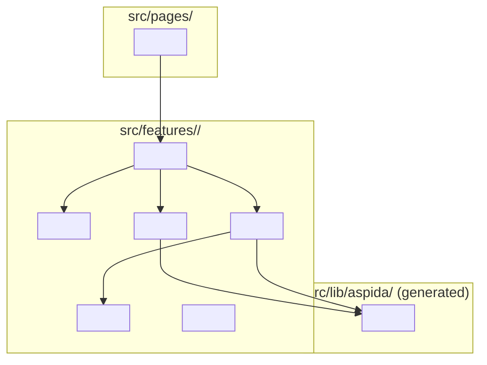
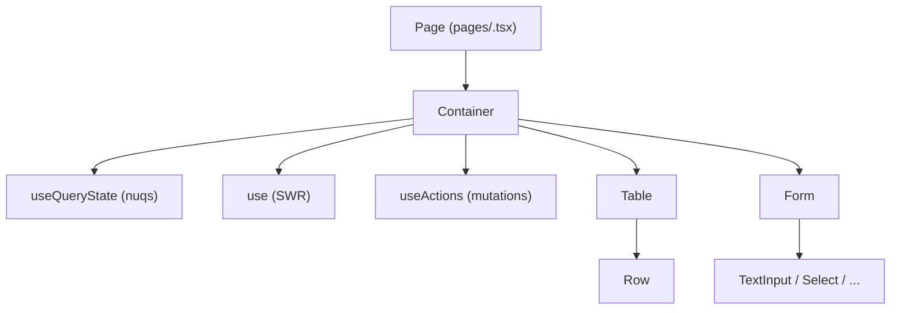

# Design: <!-- Feature Name -->

> **Spec slug**: <!-- slug -->
> **Status**: draft
> **Last updated**: <!-- YYYY-MM-DD -->

---

## 0. Auto-Design Summary _(auto mode only)_

<!-- In --mode auto, insert a plain-language paragraph here summarising every design
     decision for non-engineer review. Remove this section in --mode standard. -->

---

## 1. Overview

<!-- 2-4 sentences describing what this feature does, which user problem it solves,
     and the key technical approach. -->

### 1.1 Scope

**In-scope**:

- <!-- item -->

**Out-of-scope**:

- <!-- item -->

Satisfies: <!-- REQ-XXX -->

---

## 2. Architecture Diagram



Satisfies: <!-- REQ-XXX -->

---

## 3. File Structure Plan

Files to **create** (new):

```
src/
└── features/
    └── <feature>/
        ├── api/
        │   ├── mutations.ts          <!-- POST/PUT/DELETE wrappers returning Result -->
        │   └── queries.ts            <!-- GET wrappers (if separate from hooks) -->
        ├── components/
        │   ├── <feature>-container.tsx   <!-- data-fetching container -->
        │   ├── <feature>-form.tsx        <!-- form with @mantine/form -->
        │   └── <feature>-table.tsx       <!-- list/table presentation -->
        ├── hooks/
        │   ├── use-<feature>.ts              <!-- SWR data hook -->
        │   ├── use-<feature>-actions.ts      <!-- mutation hook -->
        │   └── use-<feature>-query-state.ts  <!-- nuqs URL state -->
        ├── mocks/
        │   └── handlers.ts           <!-- MSW handlers -->
        ├── schemas/
        │   └── <feature>-schema.ts   <!-- Valibot schema + InferOutput type -->
        ├── stores/
        │   └── <feature>-store.ts    <!-- Jotai atoms (only if client state needed) -->
        └── types/
            └── <feature>.ts          <!-- domain types (derived from generated types) -->
```

Files to **modify** (existing):

```
src/lib/msw/server.ts          <!-- register new handlers -->
src/mocks/handlers.ts          <!-- aggregate new feature handlers -->
src/pages/<route>.tsx          <!-- add new page (if applicable) -->
```

Satisfies: <!-- cross-cutting concern, no direct REQ -->

---

## 4. State Management

| State                  | Type   | Tool               | Location                             |
| ---------------------- | ------ | ------------------ | ------------------------------------ |
| <!-- list data -->     | Server | SWR (useAspidaSWR) | `hooks/use-<feature>.ts`             |
| <!-- selected item --> | Client | Jotai atom         | `stores/<feature>-store.ts`          |
| <!-- filter/page -->   | URL    | nuqs               | `hooks/use-<feature>-query-state.ts` |
| <!-- form data -->     | Form   | @mantine/form      | `components/<feature>-form.tsx`      |

### 4.1 SWR Hook Design

```typescript
// hooks/use-<feature>.ts — sketch only, full impl in tasks
export function use<Feature>({ filter, page }: Use<Feature>Options) {
  const { data, error, isLoading, mutate } = useAspidaSWR(
    apiClient.api.v1.<resource>,
    '$get',
    {
      keepPreviousData: true,
      query: { page, /* filter fields */ },
      revalidateOnFocus: false,
    },
  )
  return {
    <resource>: data?.<resource> ?? [],
    error,
    isLoading,
    pagination: data?.meta ?? DEFAULT_PAGINATION,
    refetch: mutate,
  } as const
}
```

### 4.2 URL State (nuqs) Design

```typescript
// hooks/use-<feature>-query-state.ts — sketch only
const <feature>QueryParsers = {
  page: parseAsInteger.withDefault(1),
  <!-- filter fields -->
} as const satisfies Record<keyof <Feature>Filter | 'page', SingleParserBuilder<...>>
```

Satisfies: <!-- REQ-XXX -->

---

## 5. API Layer

| Method | Endpoint                 | aspida call                                     | Used by            |
| ------ | ------------------------ | ----------------------------------------------- | ------------------ |
| GET    | `/api/v1/<resource>`     | `apiClient.api.v1.<resource>.$get(...)`         | `use-<feature>.ts` |
| POST   | `/api/v1/<resource>`     | `apiClient.api.v1.<resource>.$post(...)`        | `mutations.ts`     |
| PUT    | `/api/v1/<resource>/:id` | `apiClient.api.v1.<resource>._id(id).$put(...)` | `mutations.ts`     |
| DELETE | `/api/v1/<resource>/:id` | `apiClient.api.v1.<resource>._id(id).$delete()` | `mutations.ts`     |

### 5.1 Mutation Pattern

```typescript
// api/mutations.ts — sketch only
export function create<Feature>(input: Create<Feature>Input) {
  return Result.tryPromise({
    catch: toApiError,
    try: async () => {
      const response = await apiClient.api.v1.<resource>.$post({
        body: { <resource>: input },
      })
      return response
    },
  })
}
```

Satisfies: <!-- REQ-XXX -->

---

## 6. Component Hierarchy



### 6.1 Component Responsibilities

| Component                  | Responsibility                                                                     |
| -------------------------- | ---------------------------------------------------------------------------------- |
| `<feature>-container.tsx`  | Orchestrates data fetching, passes props down, handles success/error notifications |
| `<feature>-table.tsx`      | Renders list; no data fetching; receives data and callbacks as props               |
| `<feature>-form.tsx`       | @mantine/form + Valibot schema; emits validated data via onSubmit prop             |
| `use-<feature>.ts`         | SWR query; no mutations                                                            |
| `use-<feature>-actions.ts` | Calls mutations; calls SWR mutate() on success                                     |

Satisfies: <!-- REQ-XXX -->

---

## 7. Error Handling Strategy

All API calls use `better-result` (`Result.tryPromise`) at the mutations layer.

```typescript
// hooks/use-<feature>-actions.ts — match pattern (err before ok, alphabetical)
result.match({
  err: (error) => {
    showError({ message: error.message, title: 'エラー' })
  },
  ok: () => {
    showSuccess({ message: '<!-- success message -->' })
    void refetch()
  },
})
```

| Scenario           | Handling                                                               |
| ------------------ | ---------------------------------------------------------------------- |
| API 4xx validation | Show field-level error via Mantine notification                        |
| API 5xx / network  | Show generic error notification; do not crash                          |
| 401 / 403          | Handled globally by `handleAuthError` in `api-client.ts`               |
| 404                | Handled globally by `handleNotFoundError` in `api-client.ts`           |
| Form validation    | Blocked by Valibot schema before submit; shown inline by @mantine/form |

Satisfies: <!-- cross-cutting concern, no direct REQ -->

---

## 8. Test Strategy

Following the Testing Trophy targets from `.claude/rules/common/testing.md`:

```
E2E (Playwright)          10%
Integration (Vitest+MSW)  60%  ← primary
Unit (Vitest)             25%
Visual (Storybook VRT)     5%
```

| File                                 | Test type                | Priority | Coverage target             |
| ------------------------------------ | ------------------------ | -------- | --------------------------- |
| `schemas/<feature>-schema.ts`        | Unit (valibot safeParse) | P1       | Valid + invalid inputs      |
| `hooks/use-<feature>-actions.ts`     | Integration (MSW)        | P1       | Success + API error paths   |
| `hooks/use-<feature>.ts`             | Integration (MSW)        | P2       | Loading, data, error states |
| `components/<feature>-container.tsx` | Integration (render+MSW) | P2       | Full CRUD flow              |
| `components/<feature>-form.tsx`      | Unit (render+props)      | P3       | Validation messages visible |

MSW handlers live in `mocks/handlers.ts` and are registered in `src/lib/msw/server.ts`.
Test queries use `getByRole` / `getByText` only — no `data-testid`.

Satisfies: <!-- REQ-XXX -->

---

## 9. Open Questions

<!-- List any unresolved decisions here. Remove before implementation starts. -->

- [ ] <!-- question -->

---

_Template: `.claude/skills/sdd-design/templates/design.md`_
